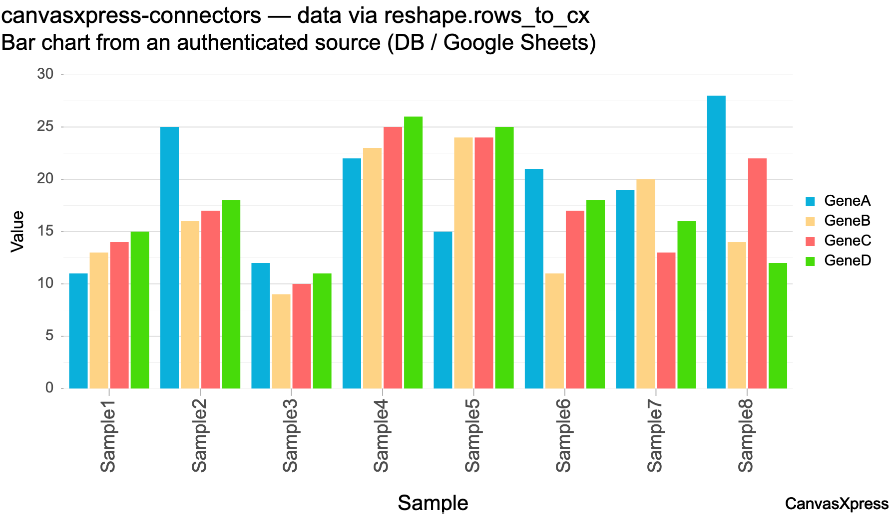

# canvasxpress-connectors

[](https://github.com/neuhausi/canvasxpress-connectors/actions/workflows/ci.yml)
[](https://pypi.org/project/canvasxpress-connectors/)
[](https://pypi.org/project/canvasxpress-connectors/)
[](LICENSE)

Feed [CanvasXpress](https://www.canvasxpress.org/) from **authenticated** data sources —
databases and Google Sheets — by reshaping query results into CanvasXpress data objects
served from **your own origin**. The browser never holds a credential.

```
Browser (CanvasXpress)  ──►  your app (this package)  ──►  authenticated source
   no secrets                 auth + encrypted creds        DB / Google Sheets
```



## Install

```bash
pip install canvasxpress-connectors            # core only (needs just cryptography)
pip install "canvasxpress-connectors[sql]"     # + SQLAlchemy databases
pip install "canvasxpress-connectors[sheets]"  # + Google Sheets
pip install "canvasxpress-connectors[all]"     # everything incl. the web app
```

## The 3-second version

Any source returns `(header, rows)`; `rows_to_cx` turns that into a CanvasXpress object:

```python
from cx_connectors.sources import SqlSource
from cx_connectors.sources.base import to_cx

data = to_cx(SqlSource(
    "sqlite:///demo.db",
    'SELECT sample, GeneA, GeneB, category AS "Category" FROM expression',
))
# {"y": {"vars": ["GeneA","GeneB"], "smps": [...], "data": [...]}, "x": {"Category": [...]}}
```

Return `data` as JSON from an endpoint; the page does `new CanvasXpress("cx", data, {...})`.

## Architecture

| Layer | Module | Job |
|-------|--------|-----|
| Reshape | `cx_connectors.reshape` | rows → CanvasXpress `{y, x}` (core, no heavy deps) |
| Sources | `cx_connectors.sources` | `DataSource` protocol + `SqlSource`, `GoogleSheetsSource` |
| Store | `cx_connectors.store` | users (PBKDF2) + per-user **encrypted** connection strings |
| Web | `cx_connectors.web` | `create_byo_app()` (database, login) · `create_sheets_app()` (Google Sheets, OAuth) — mountable FastAPI apps |

Adding a backend (BigQuery, a REST API, CSV) = one class with a `read()` returning
`(header, rows)`. Nothing else changes.

## Runnable demo — bring-your-own-database, with login

Each user logs in, registers **their own** database (connection string stored
encrypted), and charts **their own** data. Users are isolated by session.

```bash
pip install -e ".[all]"
export ENCRYPTION_KEY=$(python -c "from cx_connectors.store import generate_key;print(generate_key())")
export SESSION_SECRET=$(python -c "import secrets;print(secrets.token_urlsafe(32))")
python examples/seed_demo.py     # users alice & bob, each with their own SQLite DB
python examples/run_byo.py       # http://localhost:8100
```

Log in as `alice`/`alicepw` and `bob`/`bobpw` (incognito) — each sees only their own rows.

## Runnable demo — Google Sheets, per-user OAuth

Each user connects **their own** Google account; the app reads **their** private sheet.
The browser never sees a Google token or URL.

Prereqs: a Google OAuth **Web application** client (Cloud Console → Credentials) with
redirect URI `http://localhost:8080/oauth/callback`, and the **Google Sheets API** enabled.

```bash
pip install -e ".[all]"
export GOOGLE_CLIENT_ID=...  GOOGLE_CLIENT_SECRET=...
export OAUTH_REDIRECT_URI=http://localhost:8080/oauth/callback
export SESSION_SECRET=$(python -c "import secrets;print(secrets.token_urlsafe(32))")
export TOKEN_ENCRYPTION_KEY=$(python -c "from cx_connectors.store import generate_key;print(generate_key())")
export OAUTHLIB_INSECURE_TRANSPORT=1     # localhost http only; remove in production
python examples/run_sheets.py            # http://localhost:8080 → Connect Google Sheets
```

## Use it inside your own FastAPI

```python
from cx_connectors.web import create_byo_app, create_sheets_app
app = create_byo_app(https_only=True)      # database app: login + per-user DBs
# or
app = create_sheets_app(https_only=True)   # Google Sheets app: per-user OAuth
```

Or just the pieces — call `SqlSource` / `GoogleSheetsSource` + `rows_to_cx` from your
own handlers, and bring your own auth.

## Databases beyond SQLite

Connection strings are SQLAlchemy URLs; add the driver and go:

- Postgres: `pip install "psycopg[binary]"` → `postgresql+psycopg://user:pw@host/db`
- MySQL: `pip install PyMySQL` → `mysql+pymysql://user:pw@host/db`

## Security notes

- Connection strings / tokens are **Fernet-encrypted at rest**; passwords are PBKDF2-hashed.
- `SqlSource` enforces a single read-only `SELECT`; still give the DB user least-privilege read access.
- For production: HTTPS + `https_only=True` cookies, rate-limit `/auth/login`, secrets from a
  manager (not `.env`), and pool engines per source.

## Contributing

Development setup, linting/tests, how to add a new data source, and the release process
are in [CONTRIBUTING.md](CONTRIBUTING.md).

## License

MIT

