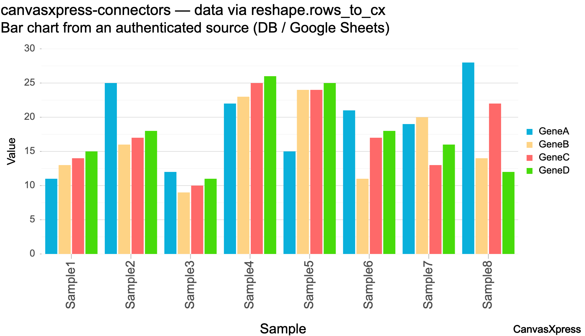

# canvasxpress-connectors

[](https://github.com/neuhausi/canvasxpress-connectors/actions/workflows/ci.yml)
[](https://pypi.org/project/canvasxpress-connectors/)
[](https://pypi.org/project/canvasxpress-connectors/)
[](LICENSE)

Feed [CanvasXpress](https://www.canvasxpress.org/) from **authenticated** data sources —
databases and Google Sheets — by reshaping query results into CanvasXpress data objects
served from **your own origin**. The browser never holds a credential.

```
Browser (CanvasXpress)  ──►  your app (this package)  ──►  authenticated source
   no secrets                 auth + encrypted creds        DB / Google Sheets
```



## Install

```bash
pip install canvasxpress-connectors            # core only (needs just cryptography)
pip install "canvasxpress-connectors[sql]"     # + SQLAlchemy databases
pip install "canvasxpress-connectors[sheets]"  # + Google Sheets
pip install "canvasxpress-connectors[analytics]" # + Google Analytics 4 (GA4)
pip install "canvasxpress-connectors[salesforce]" # + Salesforce (SOQL)
pip install "canvasxpress-connectors[servicenow]" # + ServiceNow (Table API)
pip install "canvasxpress-connectors[all]"     # everything incl. the web app
```

## The 3-second version

Any source returns `(header, rows)`; `rows_to_cx` turns that into a CanvasXpress object:

```python
from cx_connectors.sources import SqlSource
from cx_connectors.sources.base import to_cx

data = to_cx(SqlSource(
    "sqlite:///demo.db",
    'SELECT sample, GeneA, GeneB, category AS "Category" FROM expression',
))
# {"y": {"vars": ["GeneA","GeneB"], "smps": [...], "data": [...]}, "x": {"Category": [...]}}
```

Return `data` as JSON from an endpoint; the page does `new CanvasXpress("cx", data, {...})`.

## Architecture

| Layer | Module | Job |
|-------|--------|-----|
| Reshape | `cx_connectors.reshape` | rows → CanvasXpress `{y, x}` (core, no heavy deps) |
| Sources | `cx_connectors.sources` | `DataSource` protocol + `SqlSource`, `GoogleSheetsSource`, `GoogleAnalyticsSource`, `SalesforceSource`, `ServiceNowSource` |
| Store | `cx_connectors.store` | users (PBKDF2) + per-user **encrypted** connection strings |
| Web | `cx_connectors.web` | `create_byo_app()` (databases + Salesforce/ServiceNow, login) · `create_sheets_app()` (Google Sheets, OAuth) — mountable FastAPI apps |

Adding a backend (BigQuery, a REST API, CSV) = one class with a `read()` returning
`(header, rows)`. Nothing else changes.

## Runnable demo — bring-your-own-database, with login

Each user logs in, registers **their own** database (connection string stored
encrypted), and charts **their own** data. Users are isolated by session.

```bash
pip install -e ".[all]"
export ENCRYPTION_KEY=$(python -c "from cx_connectors.store import generate_key;print(generate_key())")
export SESSION_SECRET=$(python -c "import secrets;print(secrets.token_urlsafe(32))")
python examples/seed_demo.py     # users alice & bob, each with their own SQLite DB
python examples/run_byo.py       # http://localhost:8100
```

Log in as `alice`/`alicepw` and `bob`/`bobpw` (incognito) — each sees only their own rows.

## Runnable demo — Google Sheets, per-user OAuth

Each user connects **their own** Google account; the app reads **their** private sheet.
The browser never sees a Google token or URL.

Prereqs: a Google OAuth **Web application** client (Cloud Console → Credentials) with
redirect URI `http://localhost:8080/oauth/callback`, and the **Google Sheets API** enabled.

```bash
pip install -e ".[all]"
export GOOGLE_CLIENT_ID=...  GOOGLE_CLIENT_SECRET=...
export OAUTH_REDIRECT_URI=http://localhost:8080/oauth/callback
export SESSION_SECRET=$(python -c "import secrets;print(secrets.token_urlsafe(32))")
export TOKEN_ENCRYPTION_KEY=$(python -c "from cx_connectors.store import generate_key;print(generate_key())")
export OAUTHLIB_INSECURE_TRANSPORT=1     # localhost http only; remove in production
python examples/run_sheets.py            # http://localhost:8080 → Connect Google Sheets
```

## Use it inside your own FastAPI

```python
from cx_connectors.web import create_byo_app, create_sheets_app
app = create_byo_app(https_only=True)      # database app: login + per-user DBs
# or
app = create_sheets_app(https_only=True)   # Google Sheets app: per-user OAuth
```

Or just the pieces — call `SqlSource` / `GoogleSheetsSource` + `rows_to_cx` from your
own handlers, and bring your own auth.

## Databases beyond SQLite

`SqlSource` is backend-agnostic — it has **no database-specific code**. Any database with a
SQLAlchemy dialect works by changing only the connection URL; add the driver and go. Each
database has a convenience extra (`pip install "canvasxpress-connectors[<name>]"`) that pulls
SQLAlchemy plus the right DBAPI driver:

| Database | Extra | Driver | Connection URL |
|----------|-------|--------|----------------|
| PostgreSQL | `[postgres]` | `psycopg` | `postgresql+psycopg://user:pw@host/db` |
| MySQL | `[mysql]` | `PyMySQL` | `mysql+pymysql://user:pw@host/db` |
| MS SQL Server | `[mssql]` | `pyodbc` | `mssql+pyodbc://user:pw@host/db?driver=ODBC+Driver+18+for+SQL+Server` |
| Oracle | `[oracle]` | `oracledb` | `oracle+oracledb://user:pw@host:1521/?service_name=ORCLPDB1` |
| Teradata | `[teradata]` | `teradatasqlalchemy` | `teradatasql://user:pw@host` |
| Snowflake | `[snowflake]` | `snowflake-sqlalchemy` | `snowflake://user:pw@account/db/schema?warehouse=wh&role=r` |
| Google BigQuery | `[bigquery]` | `sqlalchemy-bigquery` | `bigquery://<project>/<dataset>` (auth out-of-band, see below) |
| Amazon Redshift | `[redshift]` | `redshift-connector` | `redshift+redshift_connector://user:pw@host:5439/db` |
| Azure Synapse | `[mssql]` | `pyodbc` | `mssql+pyodbc://user:pw@host:1433/db?driver=ODBC+Driver+18+for+SQL+Server` |
| Databricks | `[databricks]` | `databricks-sql-connector` | `databricks://token:<PAT>@<host>?http_path=/sql/1.0/warehouses/<id>&catalog=<c>&schema=<s>` |

The read-only `SELECT` guard and `:name` bind-parameter forwarding work identically across all
of them, since they operate on the SQL string, not the backend. A few backend notes:

- **MS SQL Server / Azure Synapse** also need Microsoft's native **ODBC Driver 18** installed on
  the host (the `pyodbc` package is only the Python binding). Synapse is SQL Server-wire-compatible,
  so it reuses the `[mssql]` extra and the `mssql+pyodbc://` URL — point it at the dedicated SQL
  pool endpoint. `pymssql` is an alternative that bundles its own driver:
  `pip install pymssql` → `mssql+pymssql://user:pw@host/db`.
- **Teradata**'s dialect (`teradatasqlalchemy`) is maintained by Teradata; pin/verify it against
  your SQLAlchemy version. A quick connection test before relying on it is worthwhile.
- **Google BigQuery** does not authenticate through the URL — it uses a service-account JSON or
  Application Default Credentials from the environment (e.g. `GOOGLE_APPLICATION_CREDENTIALS=/path/sa.json`),
  so the URL is just `bigquery://<project>` or `bigquery://<project>/<dataset>`. Give the service
  account read-only (`roles/bigquery.dataViewer` + `bigquery.jobUser`) access.
- **Amazon Redshift** is Postgres-wire-compatible: `redshift+redshift_connector://` uses Amazon's
  driver (recommended, supports IAM auth), but `postgresql+psycopg://…:5439/db` also works if you
  prefer the plain Postgres driver.

### Databricks

Databricks SQL Warehouses (and clusters) speak SQL through the
[`databricks-sql-connector`](https://pypi.org/project/databricks-sql-connector/) SQLAlchemy
dialect, so `SqlSource` reaches them with **no new code** — only the connection URL changes:

```python
import os
from cx_connectors.sources import SqlSource
from cx_connectors.sources.base import to_cx

CONN_URL = (
    "databricks://token:" + os.environ["DATABRICKS_TOKEN"] + "@"
    + os.environ["DATABRICKS_HOST"]                       # dbc-xxxx.cloud.databricks.com
    + "?http_path=" + os.environ["DATABRICKS_HTTP_PATH"]  # /sql/1.0/warehouses/<id>
    + "&catalog=main&schema=default"
)
data = to_cx(SqlSource(
    CONN_URL,
    "SELECT sample, geneA, geneB, category FROM expression "
    "WHERE (:cohort IS NULL OR cohort = :cohort) ORDER BY sample",
))
```

The read-only `SELECT` guard, `:name` bind-parameter forwarding, and everything downstream
work unchanged. Use a Databricks **personal access token** (or an OAuth M2M token) scoped to a
least-privilege user with read-only access to the warehouse. A runnable end-to-end example is
in [`examples/databricks/`](examples/databricks/).

## Non-SQL sources (REST / SaaS APIs)

Not every source is a database. SaaS APIs (Google Analytics, Salesforce, ServiceNow, …) have
**no SQLAlchemy dialect**, so `SqlSource` can't reach them — but the `DataSource` seam is exactly
for this: a source's only job is to return `(header, rows)`, so each API is one small class and
nothing downstream changes. Google Analytics 4, Salesforce, and ServiceNow ship built-in.

### Google Analytics 4 (GA4)

`GoogleAnalyticsSource` runs a GA4 **Data API** `runReport` (dimensions + metrics over a date
range) and reshapes it: the **first dimension** becomes the sample axis, **metrics** become
numeric variables, and any **further dimensions** become per-sample annotations.

```bash
pip install "canvasxpress-connectors[analytics]"
```

```python
from google.oauth2 import service_account
from cx_connectors.sources import GoogleAnalyticsSource
from cx_connectors.sources.base import to_cx

creds = service_account.Credentials.from_service_account_file(
    "sa.json", scopes=["https://www.googleapis.com/auth/analytics.readonly"])

data = to_cx(GoogleAnalyticsSource(
    credentials=creds,
    property_id="123456789",                 # GA4 property id (digits only)
    dimensions=["date", "sessionDefaultChannelGroup"],
    metrics=["activeUsers", "sessions"],
    start_date="28daysAgo", end_date="today",
))
# y.smps = dates · y.vars = [activeUsers, sessions] · x.sessionDefaultChannelGroup = channel per row
```

Auth is **out-of-band**, like BigQuery: a service-account JSON (share the GA4 property with the
service account's email, Viewer) or user OAuth — the credential never touches the URL or the
browser. GA4 reports are inherently read-only, so there is no SELECT guard to mirror; the caller
picks the dimensions/metrics server-side.

### Salesforce (SOQL)

`SalesforceSource` runs a **SOQL** query and reshapes the records: the first selected field is
the sample axis, numeric fields become variables, text fields become annotations. Column order
follows the `SELECT` list, and relationship fields (`Account.Name`) are read from the nested
record. A read-only guard rejects anything that isn't a `SELECT` (mirroring `SqlSource`).

```bash
pip install "canvasxpress-connectors[salesforce]"
```

```python
from cx_connectors.sources import SalesforceSource
from cx_connectors.sources.base import to_cx

data = to_cx(SalesforceSource(
    "SELECT Name, Amount, StageName, Account.Name FROM Opportunity WHERE IsClosed = true",
    username="integration@acme.com", password="…", security_token="…",
    domain="login",                      # "test" for a sandbox
))
# or session-based auth: SalesforceSource(soql, session_id="…", instance_url="https://…")
```

Use a least-privilege Salesforce **integration user** with read-only object/field permissions.
`query_all` follows the API's paging cursors, so large result sets come back complete.

### ServiceNow (Table API)

`ServiceNowSource` reads a table through the REST **Table API** (`GET /api/now/table/<table>`)
with an encoded `sysparm_query`. It only ever issues `GET`, so it is read-only by construction.
Reference/choice fields (returned as `{display_value, value}`) are flattened to their display
value.

```bash
pip install "canvasxpress-connectors[servicenow]"
```

```python
from cx_connectors.sources import ServiceNowSource
from cx_connectors.sources.base import to_cx

data = to_cx(ServiceNowSource(
    instance="acme",                     # acme.service-now.com
    table="incident",
    query="active=true^priority=1",      # encoded ServiceNow query
    fields=["number", "priority", "category"],   # also fixes column order
    limit=1000,
    username="integration", password="…",        # basic auth; use an integration user
))
```

Give the ServiceNow user a least-privilege read-only role (ACLs still apply per row/field).

**OAuth 2.0** instead of basic auth: mint a short-lived bearer token and pass it as `oauth_token`.
Store the long-lived refresh token / password (encrypted), not the access token — mint one per read.

```python
from cx_connectors.sources.servicenow import servicenow_oauth_token

token = servicenow_oauth_token(
    "acme", client_id="…", client_secret="…",
    username="integration", password="…",   # password grant
    # or: refresh_token="…"                  # refresh_token grant
)
data = to_cx(ServiceNowSource(instance="acme", table="incident",
                              fields=["number", "priority"], oauth_token=token))
```

### Registering SaaS sources through the web app

The BYO web app (`create_byo_app` / the `/connectors` demo) registers these too, not just
databases. The **Type** selector on the register-source form switches between *SQL database*,
*Salesforce (SOQL)*, and *ServiceNow (Table API)*; ServiceNow offers **Basic** or **OAuth 2.0**
auth. Credentials are stored **encrypted** exactly like a connection string — for ServiceNow
OAuth, the refresh/password credentials are stored and a bearer token is minted per request. The
`POST /api/sources` body carries `kind` (`"salesforce"`/`"servicenow"`) plus an `auth` object;
`GET /api/data?source=<name>` then runs the SOQL query / Table API read and reshapes it.

## Parameterized queries (live-data controls)

A source's SQL can declare `:name` bind parameters, and `GET /api/data?source=…&name=…`
forwards matching request params into them — **only** the params the query declares,
always as **bound** parameters (never string-interpolated), so the browser can supply
values but never alter the query shape. An unknown/extra request key is ignored; a
declared param absent from the request is bound as `NULL`, so the `(:name IS NULL OR …)`
idiom lets a control "widen" back to everything.

```python
store.save_source(
    "alice", "sales",
    "sqlite:///file:/srv/data/sales.sqlite?mode=ro&uri=true",
    'SELECT sample, revenue FROM sales '
    'WHERE (:region IS NULL OR region = :region) '
    '  AND (:q IS NULL OR product LIKE :q) '
    'ORDER BY sample',
)
```

Then `/api/data?source=sales&region=EMEA` binds `region="EMEA"`, `q=NULL`. This is what a
[canvasxpress-dashboards](https://github.com/neuhausi/canvasxpress-dashboards) `mode:"param"`
control drives: a source `"query": { "region": "$region", "q": "$q" }` maps the dashboard
parameters onto these bind names. For a `LIKE` search, wrap the value with `%` in SQL —
`'%' || :q || '%'` — rather than in the browser.

To register many sources for a deployment at once (instead of the `/connectors` UI), use
[`examples/_tools/register_sources.py`](examples/_tools/register_sources.py) with a JSON
config (`examples/_tools/sources.example.json`) — the DB files stay on the server; only the
encrypted URL + SQL are stored, and it prints each source's declared bind params.

## Packed-matrix sources (CCLE / TCGA expression)

Some reference databases store an expression / copy-number matrix in a **packed** form
for fast single-gene retrieval — one row per gene holding a JSON array of its values
across all samples, plus a shared `json` template table carrying the sample axis +
annotations once. A plain `SELECT` can't reassemble that, so a **`packed`** source does:
it loads the template, fetches the requested genes' arrays, and appends each as a
`vars`/`data` row, yielding a CanvasXpress object for a boxplot / violin / heatmap.

Register one with `kind="packed"` and a config (the gene list comes from a request param
named by `gene_param`, comma-separated), then the source drives a gene-search dashboard
control live:

```python
store.save_source(
    "alice", "ccle-rna-expression",
    "sqlite:///file:/srv/cxd-data/ccle.sqlite?mode=ro&uri=true",
    "",                                   # no SQL for a packed source
    kind="packed",
    config={"table": "rnaseq", "value_col": "log2tpm", "template_key": "rna1",
            "gene_param": "genes"},
)
# GET /api/data?source=ccle-rna-expression&genes=TP53,KRAS
```

Table/column identifiers come from this server-side config (validated as SQL identifiers);
gene values are always bound parameters.

The packed encoding is configurable, so the one source type covers CCLE/TCGA **and** GTEx:
- `value_encoding`: `"json"` (a JSON array, CCLE/TCGA) or `"delimited"` with `value_sep`
  (GTEx stores tpm as a `;`-separated string).
- template location: `template_col` (default `str`) and `template_key` — set
  `template_key` to `null` when the template table holds a single row (GTEx's
  `json.samples`), otherwise it's looked up by `template_key_col` (default `key`).

```python
# GTEx: ;-separated tpm, single-row template in json.samples
config={"table": "expression", "value_col": "tpm", "name_col": "geneName",
        "template_key": None, "template_col": "samples",
        "value_encoding": "delimited", "value_sep": ";"}
```

## Security notes

- Connection strings / tokens are **Fernet-encrypted at rest**; passwords are PBKDF2-hashed.
- `SqlSource` enforces a single read-only `SELECT`; still give the DB user least-privilege read access.
- **Query params are bound, never interpolated**, and only the `:name` binds the SQL declares
  are forwarded — an injected `?foo=…` key never reaches the database.
- For production: HTTPS + `https_only=True` cookies, rate-limit `/auth/login`, secrets from a
  manager (not `.env`), and pool engines per source.

## Deploying the BYO-database demo behind a reverse-proxy subpath (canvasxpress.org)

The demo runs as a plain localhost uvicorn service exposed by Apache under a
path prefix — the same pattern as the
[canvasxpress-mcp](https://github.com/neuhausi/canvasxpress-mcp) server. The
demo UI (`src/cx_connectors/web/static/index.html`) derives its API base from
the path it is served under, so it works at `/` in development and at
`/connectors/` in production. The deployment at
`https://www.canvasxpress.org/connectors/` was set up exactly as follows
(2026-08-20).

### 1 — Install (as the site user)

```bash
ssh canvasxpress@canvasxpress.org -p 7822
git clone https://github.com/neuhausi/canvasxpress-connectors.git
cd canvasxpress-connectors
python3 -m venv .venv
.venv/bin/pip install -e '.[all]'
```

### 2 — Persistent secrets + demo seed

Secrets live in `examples/byo_database/.env` (gitignored, `chmod 600`) so the
encrypted connection strings survive restarts:

```bash
cd examples/byo_database
EK=$(../../.venv/bin/python -c 'from cx_connectors.store import generate_key;print(generate_key())')
SS=$(../../.venv/bin/python -c 'import secrets;print(secrets.token_urlsafe(32))')
printf 'ENCRYPTION_KEY=%s\nSESSION_SECRET=%s\nHTTPS_ONLY=1\nMOUNT_PREFIX=/connectors\n' "$EK" "$SS" > .env
chmod 600 .env
../../.venv/bin/python seed_demo.py     # users alice/alicepw & bob/bobpw
```

`HTTPS_ONLY=1` marks the session cookie Secure (the app sits behind Apache
TLS). The cookie is named `cxc_session` so it can't collide with the co-hosted
canvasxpress-dashboards app (`cxd_session`).

`MOUNT_PREFIX` is needed because cPanel's LiteSpeed (which parses the Apache
config) forwards the request path **unstripped** through a
`ProxyPass`-in-`<Location>` — the backend receives `/connectors/...`, not
`/...`. With the prefix set, `examples/byo_database/app.py` mounts the app at
both `/` and `/connectors`, so it works direct and proxied. (On genuine Apache
httpd, which strips the matched prefix, you can omit it.)

### 3 — Run it on port 8300

Port **8300** avoids the MCP server (8100) and dashboards (8200) on the same
host. A `server.sh` in the repo root wraps uvicorn:

```bash
cd ~/canvasxpress-connectors
./server.sh start        # stop | restart | status
curl -s -o /dev/null -w '%{http_code}\n' http://127.0.0.1:8300/   # → 200
```

Logs and pidfile land in `examples/byo_database/`. It does **not** auto-start
on reboot; add a crontab entry if you want that:

```
@reboot /home/canvasxpress/canvasxpress-connectors/server.sh start
```

### 4 — Expose it through Apache (as root, one time)

Shared with the dashboards app — one userdata include, staged at
`~canvasxpress/dashboards-connectors-proxy.conf`:

```apache
# Trailing-slash URLs are required: the UI derives its API base from the prefix.
RedirectMatch ^/connectors$ /connectors/

<Location /connectors>
    PassengerEnabled Off
    ProxyPass http://127.0.0.1:8300
    ProxyPassReverse http://127.0.0.1:8300
</Location>
```

```bash
cp ~canvasxpress/dashboards-connectors-proxy.conf \
   /etc/apache2/conf.d/userdata/ssl/2_4/canvasxpress/canvasxpress.org/
/scripts/ensure_vhost_includes --user=canvasxpress
/scripts/restartsrv_httpd
```

The demo is then live at `https://www.canvasxpress.org/connectors/`
(log in as `alice`/`alicepw` or `bob`/`bobpw`).

To update the deployment: `git pull && ./server.sh restart` (re-run
`pip install -e '.[all]'` if dependencies changed).

## Contributing

Development setup, linting/tests, how to add a new data source, and the release process
are in [CONTRIBUTING.md](CONTRIBUTING.md).

## License

MIT

