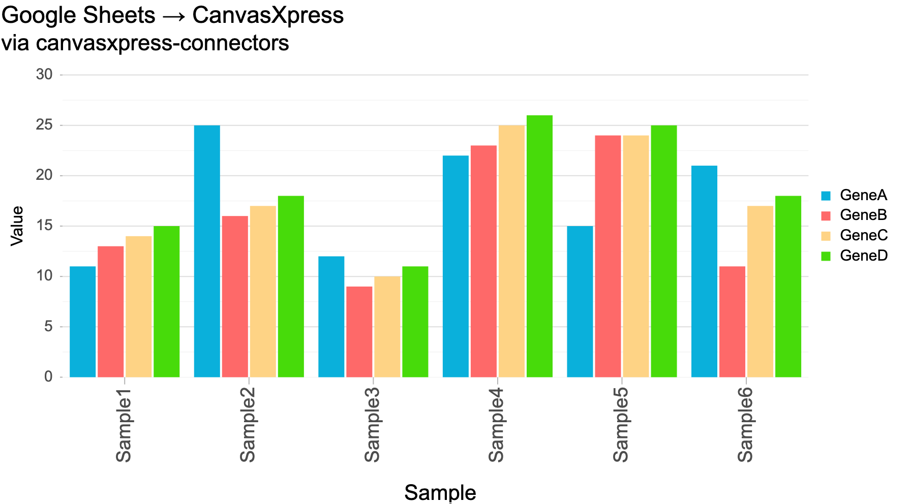

# Google Sheets → CanvasXpress (per-user OAuth)



Each user connects **their own** Google account; the app reads **their** private sheet
and charts it. The browser never sees a Google token or URL. Uses
`cx_connectors.web.create_sheets_app`.

## 1. Google OAuth client

1. [Google Cloud Console](https://console.cloud.google.com/) → enable the **Google
   Sheets API**.
2. **Credentials → Create credentials → OAuth client ID → Web application.**
3. Add the redirect URI `http://localhost:8080/oauth/callback`.
4. Copy the **Client ID** and **Client secret**. While the consent screen is in
   *Testing*, add each user's email as a test user (or publish the app).

## 2. Run

```bash
# from the repo root, once:
pip install -e ".[all]"

cd examples/google_sheets
export GOOGLE_CLIENT_ID=...  GOOGLE_CLIENT_SECRET=...
export OAUTH_REDIRECT_URI=http://localhost:8080/oauth/callback
export SESSION_SECRET=$(python -c "import secrets;print(secrets.token_urlsafe(32))")
export TOKEN_ENCRYPTION_KEY=$(python -c "from cx_connectors.store import generate_key;print(generate_key())")
export OAUTHLIB_INSECURE_TRANSPORT=1     # localhost http only; remove in production
uvicorn app:app --port 8080              # open http://localhost:8080
```

Click **Connect Google Sheets**, then paste a sheet URL/ID and chart it.

## What it shows

- `create_sheets_app()` wires the full OAuth flow (`/oauth/login`, `/oauth/callback`),
  an encrypted per-user `TokenStore`, and `/api/sheet-data`.
- Refresh tokens are encrypted at rest; access tokens are derived on demand.
- Scope is `spreadsheets.readonly` — read-only.

For production: HTTPS + `https_only=True`, publish/verify the consent screen, and store
secrets in a manager. See the top-level README's security notes.
