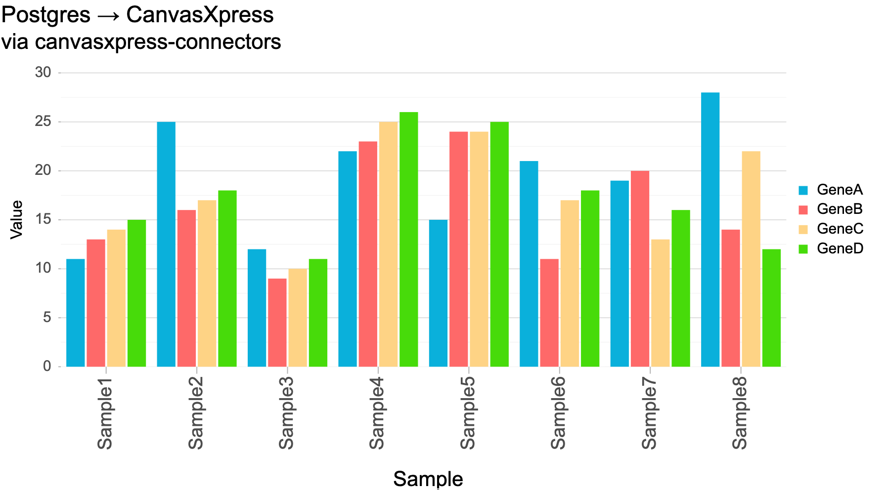

# Postgres → CanvasXpress



Same as the SQLite example, but against a real Postgres server — showing that
`SqlSource` is driver-agnostic: only the connection URL changes.

## 1. A Postgres to talk to

Any Postgres works. The quickest throwaway is Docker:

```bash
docker run --rm -d --name cxc-pg -p 5432:5432 \
  -e POSTGRES_PASSWORD=pw -e POSTGRES_USER=user -e POSTGRES_DB=demo postgres:16
```

## 2. Install + seed + run

```bash
# from the repo root, once:
pip install -e ".[all]"
pip install "psycopg[binary]"          # the Postgres driver

cd examples/postgres
export DATABASE_URL=postgresql+psycopg://user:pw@localhost:5432/demo
python seed.py                         # create + fill the table
uvicorn app:app --port 8095            # open http://localhost:8095
```

## What's different from SQLite

Only the connection string:

```python
# sqlite:   sqlite:///example.db
# postgres: postgresql+psycopg://user:pw@localhost:5432/demo
```

`SqlSource`, `to_cx`, `/api/data`, and the front end are unchanged. MySQL is the same
story with `pip install PyMySQL` and `mysql+pymysql://…`.

## Cleanup

```bash
docker rm -f cxc-pg
```
