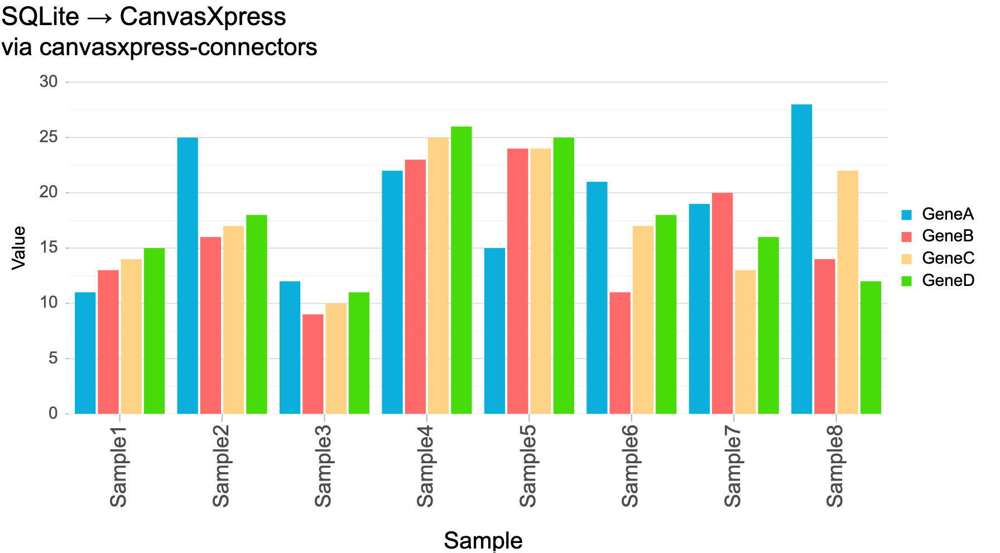

# SQLite → CanvasXpress



The smallest example: read a local SQLite file with `SqlSource`, reshape to a
CanvasXpress object, chart it. No authentication (one app-owned database) — this is the
pure data-path demo.

```bash
# from the repo root, install the package (once):
pip install -e ".[all]"

cd examples/sqlite
python seed.py                 # creates example.db
uvicorn app:app --port 8090    # open http://localhost:8090
```

## What it shows

- `SqlSource("sqlite:///example.db", "SELECT ...")` reads rows.
- `to_cx(source)` turns them into `{y: {vars, smps, data}, x: {...}}`.
- `/api/data` serves that JSON; the page hands it to `new CanvasXpress(...)`.

The whole server is ~15 lines — see `app.py`. To chart a different table, change
`QUERY` there.
